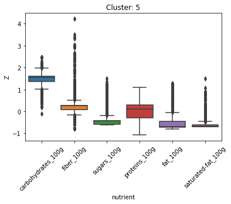

# STAT542 Final Project 

## Unsupervised Task Research Questions

1. Can we identify meaningful clusters of **ingredients** by clustering on the **macronutrient profiles** of different food products?

## KMeans

We exclude uninteresting words like water, salt, sugar. **We only include products whose ingredients are contained in a master dictionary constructed from the 1000 most common ingredients**. 

### Cluster 1: Nuts

| Ingredient | TF-IDF |
| :----------: | ------ |
|almonds     |     1349.39|
|peanuts     |     1008.16|
|peanut-oil  |      862.64|
|pecans      |      856.43|
|walnuts     |      741.62|

### Cluster 2: Canned Goods
| Ingredient | TF-IDF |
| :----------: | ------ |
|citric-acid    |     1700.57 |
|green-beans    |    1191.41  |
|ascorbic-acid  |    1174.07  |
|tomatoes       |    1109.53  |
|corn           |    1091.18  |

### Cluster 3: Sweet Beverages 
| Ingredient | TF-IDF |
| :----------: | ------ |
|corn-syrup     |     1056.59 |
|red-40         |    845.65  |
|yellow-5       |    796.83  |
|natural-and-artificial-flavors       |    731.32  |
|gelatin           |    708.45 |

### Cluster 4: Dairy Products

| Ingredient | TF-IDF |
| :----------: | ------ |
|enzymes                    |     2786.47|
|pasteurized-milk           |     2129.57|
|cheese-culture             |     1964.59|
|cheese-cultures            |      1162.08|
|pasteurized-part-skim-milk|       1083.28|

### Cluster 5: Pasta & Wheat Products

| Ingredient | TF-IDF |
| :----------: | ------ |
|niacin             |  1975.59|
|riboflavin         |  1945.83|
|folic-acid         |  1923.36|
|iron               |  1647.08|
|ferrous-sulfate    |   1609.42|

### Cluster 6: Desserts

| Ingredient | TF-IDF |
| :----------: | ------ |
|cocoa-butter      |     1286.381663 |
|soy-lecithin      |    1073.960983 |
|chocolate-liquor  |    961.954939 |
|vanilla           |      800.771596 |
|butter            |     691.866868 |

### Cluster 7: Meat

| Ingredient | TF-IDF |
| :----------: | ------ |
|shrimp                     |   1085.769701 |
|sodium-tripolyphosphate    |   772.736200 |
|to-retain-moisture         |   686.759430 |
|sodium-nitrite             |  563.855366 |
|sodium-erythorbate         |  537.485338 |

### Soft Timeline 

| Week | Task |
| --- | ----------- |
| 4/5 | Literature Review and Preprocess |
| 4/12 | Finalize Dataset |
| 4/19 | Unsupervised (PCA, Clustering) |
| 4/26 | Supervised (Linear, Tree-Based) |
| 5/3 | Begin Final Report (Summary, Lit Review, etc.) |
| 5/10 | Submission Deadline (5/11) |

### Useful Links

[Data Dictionary](https://static.openfoodfacts.org/data/data-fields.txt)

[Kaggle Usage](https://www.kaggle.com/openfoodfacts/world-food-facts/code)

[Original Paper](https://www.nature.com/articles/s41598-020-60948-w.pdf)
